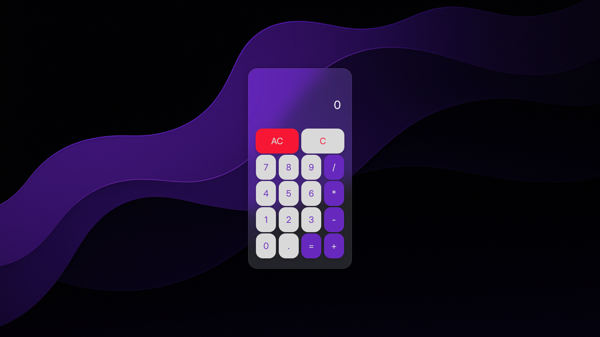

# Calculator

Simple calculator with a clean **frosted-glass UI**. Built using HTML, CSS, and JS.

## Features

- **Operations:** Supports `+`, `-`, `×`, `÷`, Clear (`C`), and All Clear (`AC`).
- **Design:** Modern Glass/Mica blur panel.
- **Input:** Full keyboard support is implemented.

### Key Bindings

| Key(s)          | Function          |
| :-------------- | :---------------- |
| **0–9, .**      | Input / Decimal   |
| **+, -, \*, /** | Operations        |
| **Enter or =**  | Calculate         |
| **Backspace**   | Delete Last Digit |
| **Escape**      | All Clear (AC)    |

---

Made with ❤️ for simple calculations.

